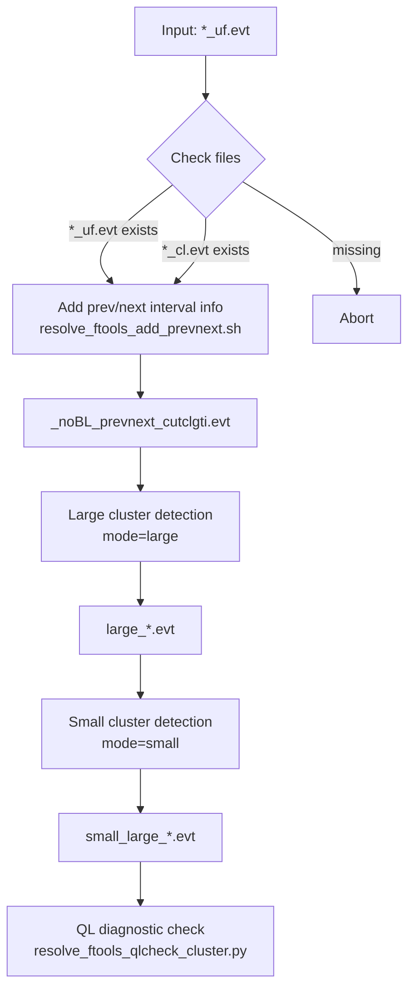

# README: Clustering Pipeline Script (Updated 2026.1.15) 

This script automates a three-step clustering pipeline to identify and diagnose pseudo-event clusters in XRISM Resolve event files.

## Script Name

```bash
resolve_ftools_cluster_pipeline.sh
```

## Usage

```bash
./resolve_ftools_cluster_pipeline.sh <input_file_uf.evt>
```

https://github.com/yamadasuzaku/rksysoft/blob/main/resolve/ftools/rslcluster/resolve_ftools_cluster_pileline.sh

### Arguments

* `<input_file_uf.evt>`
  Resolve unfiltered event file with `_uf.evt` suffix.

\CID{220} **Important**
In addition to `<input_file_uf.evt>`, the corresponding

```text
<input_file>_cl.evt
```

must exist in the same directory.
This file is required internally by `resolve_ftools_add_prevnext.sh` to create `cl.gti`.

---

## Overview of Steps

### Step 1: Add Prev/Next Interval Information

```bash
resolve_ftools_add_prevnext.sh <input_file_uf.evt>
```

https://github.com/yamadasuzaku/rksysoft/blob/main/resolve/ftools/rslcluster/resolve_ftools_add_prevnext.sh

* Adds previous/next interval\UTF{2013}related columns to the event file.
* Internally generates a GTI (`cl.gti`) based on `<input_file>_cl.evt`.
* Produces an output file with suffix:

```text
_noBL_prevnext_cutclgti.evt
```

---

### Step 2: Detect Pseudo-Event Clusters (Large → Small)

This step is executed **sequentially in two modes**, using
`resolve_ftools_detect_pseudo_event_clusters.py`.

#### 2-1. Large Cluster Detection

```bash
resolve_ftools_detect_pseudo_event_clusters.py <base_file> \
    --mode large \
    --col_cluster ICLUSTERL \
    --col_member IMEMBERL \
    --outname large_ \
    -d
```

https://github.com/yamadasuzaku/rksysoft/blob/main/resolve/ftools/rslcluster/resolve_ftools_detect_pseudo_event_clusters.py

* Detects large-amplitude clusters (e.g., cosmic-ray-like events).
* Adds:

  * `ICLUSTERL`: cluster ID
  * `IMEMBERL`: cluster membership flag

#### 2-2. Small Cluster Detection

```bash
resolve_ftools_detect_pseudo_event_clusters.py large_<base_file> \
    --mode small \
    --col_cluster ICLUSTERS \
    --col_member IMEMBERS \
    --outname small_ \
    -d
```

* Detects smaller / slower clusters after removing large-cluster events.
* Adds:

  * `ICLUSTERS`
  * `IMEMBERS`

\CID{1840} For algorithmic details, see:

* **README_add_cluster.md**
  [XRISM Resolve Pseudo-Event Clustering Tool](https://github.com/yamadasuzaku/rksysoft/blob/main/resolve/ftools/rslcluster/README_add_cluster.md)

---

### Step 3: Cluster Diagnostic Check (QL)

```bash
resolve_ftools_qlcheck_cluster.py <final_evt_file>
```

https://github.com/yamadasuzaku/rksysoft/blob/main/resolve/ftools/rslcluster/resolve_ftools_qlcheck_cluster.py

* Performs a quick-look diagnostic check of clustering results.
* Generates summary plots and logs for validation.

---

## Output Files

Intermediate and final files are generated automatically by adding prefixes/suffixes to the input filename.

| Stage          | Output File Example                                  |
| -------------- | ---------------------------------------------------- |
| Input          | `xa000000000_uf.evt`                                 |
| Step 1         | `xa000000000_noBL_prevnext_cutclgti.evt`             |
| Step 2 (large) | `large_xa000000000_noBL_prevnext_cutclgti.evt`       |
| Step 2 (small) | `small_large_xa000000000_noBL_prevnext_cutclgti.evt` |
| Step 3         | QL diagnostic plots & logs                           |

---

## File Existence Checks

The script terminates immediately if any required file is missing:

* `<input_file_uf.evt>`
* `<input_file>_cl.evt`
* Intermediate `.evt` files generated at each step

This behavior prevents silent failures in downstream processing.

---

## Requirements

The following tools must be available in your `PATH`:

* `resolve_ftools_add_prevnext.sh`
* `resolve_ftools_detect_pseudo_event_clusters.py`
* `resolve_ftools_qlcheck_cluster.py`

These tools are assumed to be part of the `rslcluster` / Resolve analysis utilities.

---

## Notes

* Intermediate files are **overwritten without confirmation**.
* It is strongly recommended to run this script in a clean working directory.
* Debug mode (`-d`) is enabled by default in clustering steps.
* The pipeline is designed to be **fully sequential and fail-fast**.

---

## Appendix A: Physical Interpretation of the Clustering Pipeline

This appendix briefly summarizes the **physical motivation** behind each step of the clustering pipeline, focusing on why the procedure is structured as *prev/next → large → small*.

---

### A.1 Why “Prev / Next Interval” Information Is Needed

Pseudo events in Resolve are not independent point events;
they often appear **temporally correlated** due to:

* charged particle hits (cosmic rays),
* afterglow--like detector responses,
* slow thermal or electronic effects.

By attaching **previous and next interval information**, the pipeline enables:

* identification of temporally contiguous event groups,
* construction of GTIs that isolate physically meaningful time segments,
* robust cluster definition based on *event-to-event spacing* rather than raw timestamps alone.

This step prepares the data so that clustering can be performed **in time-aware space**, not just event index space.

---

### A.2 Two-Stage Clustering: Why Large First, Then Small?

The clustering is intentionally divided into two sequential stages:

#### (1) Large Clusters (`mode = large`)

Large clusters typically correspond to:

* cosmic-ray--induced events,
* multi-pixel or high-energy depositions.

These events:

* dominate local statistics,
* obscure smaller-scale correlations,
* bias threshold-based detection if left untreated.

Therefore, they are detected **first** and explicitly labeled.

#### (2) Small Clusters (`mode = small`)

After removing / tagging large clusters, the remaining event stream is much cleaner.

Small clusters then capture:

* slow or subtle detector correlations,
* low-amplitude pile-up\UTF{2013}like structures,
* extended tails of physical or instrumental response.

This separation avoids mixing **physically distinct phenomena** into a single clustering population.

---

### A.3 Meaning of Cluster Columns

The pipeline adds the following columns:

| Column      | Meaning                             |
| ----------- | ----------------------------------- |
| `ICLUSTERL` | Cluster ID for large-scale clusters |
| `IMEMBERL`  | Membership flag for large clusters  |
| `ICLUSTERS` | Cluster ID for small-scale clusters |
| `IMEMBERS`  | Membership flag for small clusters  |

These labels allow downstream analysis to:

* exclude clusters selectively,
* study cluster properties independently,
* cross-check detector behavior under different event classes.

---

### A.4 Purpose of the QL Diagnostic Step

The final QL check is not merely cosmetic.

It is intended to verify that:

* cluster boundaries are physically reasonable,
* no pathological over-clustering occurred,
* time and pixel distributions remain consistent with expectations.

This step serves as a **sanity check** before scientific interpretation.

---

## Appendix B: Flow Chart of the Pipeline

The following Mermaid diagram summarizes the full pipeline flow.



---

### Reading the Flow

* The pipeline is **strictly linear** and **fail-fast**
* Each stage depends explicitly on the previous output
* Physical separation is enforced early (large vs small clusters)
* Diagnostics are applied only to the final, fully labeled event file
